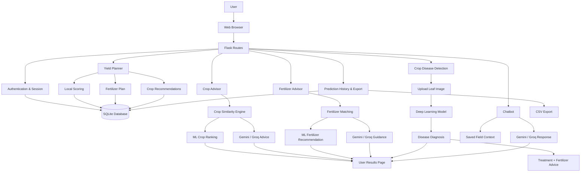
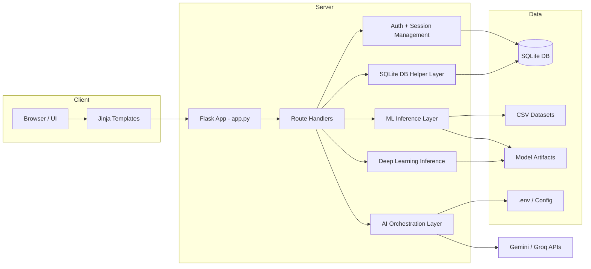
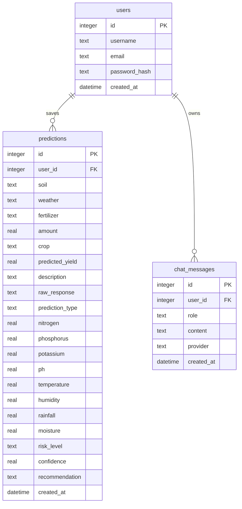
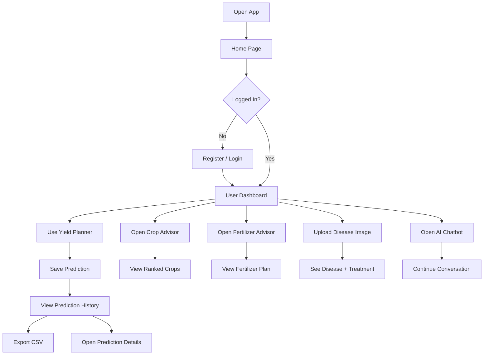
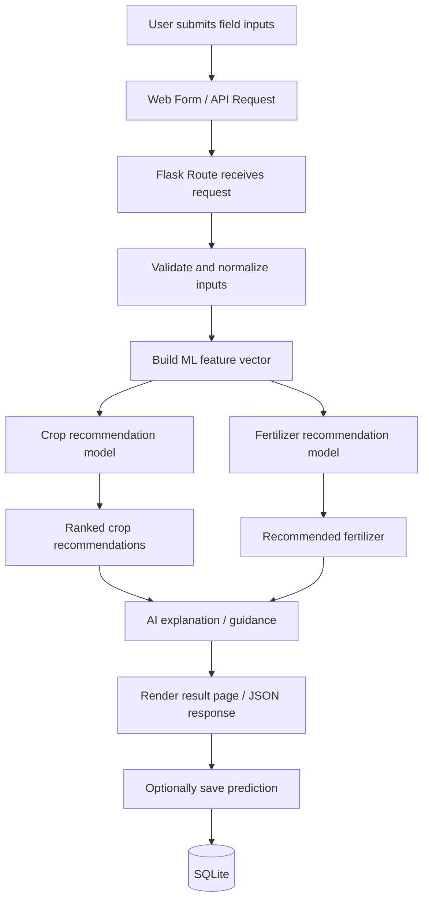
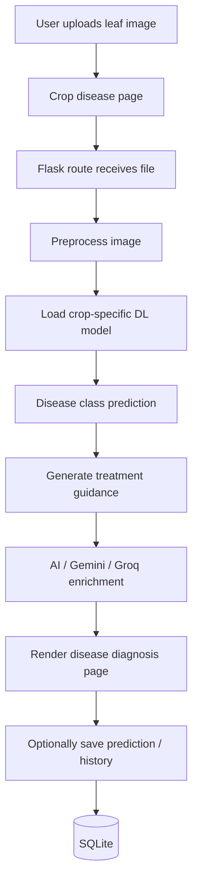
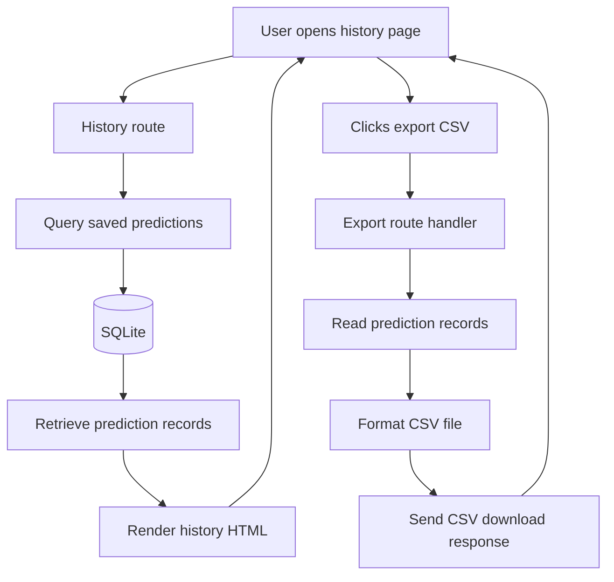

# AgriNexus Project Flow Diagram

## 1. High-Level AgriNexus Project Flow



## 2. Detailed AgriNexus System Architecture



## 3. AgriNexus System Component Diagram

```mermaid
flowchart TB
    subgraph Client
        UI[Web Browser]
        Templates[Jinja2 Templates]
    end

    subgraph Application
        Server[Flask Server (app.py)]
        Routes[Route Handlers]
        Auth[Auth & Session Manager]
        Yield[Yield Planner]
        Crop[Crop Advisor]
        Fert[Fertilizer Advisor]
        Disease[Crop Disease Detector]
        Chat[AI Chatbot]
        History[Prediction History / Export]
    end

    subgraph Services
        ML[ML Model Inference]
        DL[Deep Learning Inference]
        AI[AI / Gemini / Groq]
    end

    subgraph Storage
        DB[(SQLite)]
        Data[CSV Dataset Files]
        ModelFiles[Saved Model Files]
        Config[.env / Secrets]
    end

    UI --> Templates
    Templates --> Server
    Server --> Routes
    Routes --> Auth
    Routes --> Yield
    Routes --> Crop
    Routes --> Fert
    Routes --> Disease
    Routes --> Chat
    Routes --> History

    Yield --> ML
    Yield --> Data
    Crop --> ML
    Fert --> ML
    Disease --> DL
    Chat --> AI

    Auth --> DB
    Yield --> DB
    Crop --> DB
    Fert --> DB
    Disease --> DB
    Chat --> DB
    History --> DB

    ML --> ModelFiles
    DL --> ModelFiles
    AI --> Config
```

## 4. AgriNexus Database Entity Relationship Diagram



## 5. AgriNexus User Journey



## 6. AI/ML Prediction Workflow



## 7. Disease Detection Workflow



## 8. Prediction History and CSV Export Workflow


